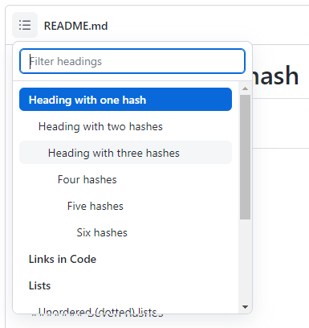

<!-- Does not work $('#readme').insertBefore('.file-navigation');  /* http://webapps.stackexchange.com/a/80064/97558 */ -->

# Heading with one hash

  A line that starts with one through six hash symbols (`#`) indicates a heading.

## Heading with two hashes
  
  Headings are automatically given a HTML-name (anchor) with lowercase letters and spaces replaced with dashes. The previous heading's name thus is `#heading-with-two-hashes`.

### Heading with three hashes

  The headings of the `README.md` files are shown when clicking on the upper left box of the 'document' (see [this image](#images)).

#### Four hashes

##### Five hashes

###### Six hashes

####### Seven hashes

# Normal text:

Normal text can use *stars* (`*text*`) and _underscores_ (`_text_`) and *_both_* (`*_text_*`), yet, both are rendered as italics.
With **double stars** (`**text**`), the text turns bold, with **_double stars and an underscore_** (`**_text_**`) it turns bold and italic.
Text between ~~two tildes~~ (`~~text~~`) is stroken through. This is text `enclosed in back-ticks` (`` `text` ``).

And then, there are also [links](https://raw.githubusercontent.com/ReneNyffenegger/about-README.md/master/README.md).
Normal urls (such as https://github.com/adam-p/markdown-here/wiki/Markdown-Cheatsheet) are rendered as links as well.

    This seems to be like code.

    Text that is indented by at least four whitespaces
    is rendered like code.

I wonder, if the following line is
`rendered like code()`
as well? (**It turns out, it's not!**)

But the following line is: 
`rendered like code()` 
is it not?

A table. Note the *right and left alignment* (by means of the *colons*):

|number|english|german |
|-----:|:------|:------|
|     1|one    |eins   |
|     2|two    |two    |
|     3|three  |drei   |
|    10|ten    |zehn   |
|    20|twenty |zwanzig|
|   100|hundred|hundert|

# Links in Code

Links in *indented* code don't work:

     function FooBar(a, b) {
        return a + b;  // [github](www.github.com)
     }

They work with the `<pre>` tag, however:

<pre>
function FooBar(a, b) {
   return a + b;  // <a href='http://www.github.com'>github</a>
}
</pre>

# Lists

## Unordered (dotted) lists

- First item of a list
- Second item of a list
  - first sub item of second item 
    additional text for first sub item of second item *Note the ` ` here.*
  - second sub item of second item
    additional text for second sub item of second item *Note the lack of a ` ` here.*
- third item
    
## Numbered lists

Numbered lists can be produced 

1. The first item

   Some text that belongs to the first item.

1. Item number two

   Text that belongs to the second item.

   More text that belongs to the second item.

   1. foo
   
      This is foo

   1. bar
   
      This is bar

   1. baz
   
      This is baz

1. **Third item**

   The numbered *headings* can even be rendered in
   bold using two stars (`**`)

# Images

  Images can be embedded and linked to with `` while `url` can be a relative link within the repository, such as demonstrated below:
  
   
# Subscript and superscript

  `text` and `text` produce subscript and superscript text.

# Horizontal Lines

Three stars `***`, underscores `___` or hyphens `---` produce a

---

# Misc

Some red text (doesn't work)

# Links

- [Markdown live demo](http://markdown-here.com/livedemo.html)
- [Adam Pritchard's markdown cheatsheet](https://github.com/adam-p/markdown-here/wiki/Markdown-Cheatsheet)
